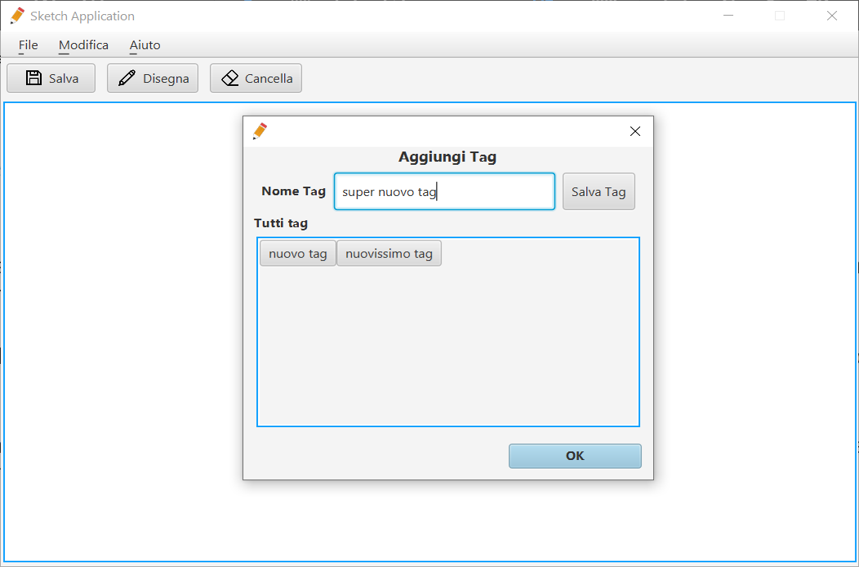

[](https://github.com/m-boutaleb/Sketch-App-Desktop/actions/workflows/deploy-backend.yml)
# Sketch App
Sketch app is a crossplatform application developed with JavaFX that allows you to draw sketches to mitigate boredom.

<p align="center">
  
</p> 

## Table of contents
* [General Info](#generalinfo)
* [Screenshots](#screenshots)
* [Technologies](#technologies)
* [Setup](#setup)
* [Features](#features)
* [Contact](#contact)


## General Info
The aim of this project is to mitigate boredom and to be able to make drawings to represent a concept with graphs. Moreover, new features have been added, such as inserting metadata to each sketch in order to search for them. The application also allows you to change the theme through preferences. This software has been designed to be evaluated as a software engineering course project.

## Screenshots
<p align="center">
  
</p> 

## Technologies
The technologies used for the development of this software are as follows:
- JDK 13.0.2
- Maven 4.0.0
- JavaFX 13.0.2
- JavaFX Scene Builder 8.5.0
- JSON-SIMPLE 1.1
- LOG4J 1.2.17
 
## Setup
Since the project was developed with Maven, the latter is responsible for creating the .jar file depending on the operating system in which you are operating. The command used to create the file package from terminal is as follows (maven already installed and added paths to environment variables):
mvn package
```sh
$ mvn package
```
This command allows you to create the .jar file with all the included dependencies. 

To run the created .jar file, it is advisable to use the java JDK to run the file with the command from the terminal: 
```sh
$ java -jar personal-sketching-system-1.0.1-jar-with-dependencies.jar
```

## Features
#### List of features ready
- Choice of application theme
- Preferred saving path
- Addition tags
- Tags removal
- Search by tags
- Total cancellation sketch 
- Choice of language
 
#### Todo-list
- Edit sketch already saved and closed

## Contact
Feel free to contact me at mohamedboutaleb@outlook.it

License
----

MIT © Mohamed Boutaleb
